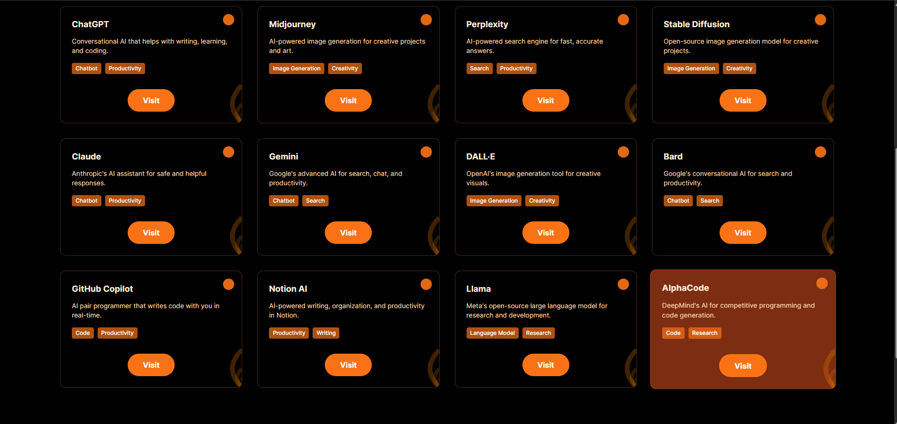

# AI Tools Showcase Website

## Overview
This is a modern, responsive gallery website that showcases the best AI tools for productivity, creativity, coding, and more. Users can browse, search, and filter a curated list of AI tools, each presented in a visually appealing card layout.

## Features
- Responsive design for all devices (desktop, tablet, mobile)
- Search and filter AI tools by category
- Modern gallery layout with variable card sizes
- Orange and black color scheme with glassmorphism effects
- Font Awesome icons for each tool
- Pagination with "See More" button
- Sticky navbar and hero section
- Easy to add or update tools in the JavaScript array

## Getting Started
1. Clone or download this repository.
2. Open `index.html` in your browser.
3. No build steps or dependencies required—everything runs in the browser.

```

## Customization
- To add or edit tools, update the `aiTools` array in `index.html`.
- To change colors or layout, edit the Tailwind CSS classes in the HTML.

## Author
Made by Ayush Raj

## Homepage Screenshot


## Tools Grid Screenshot


